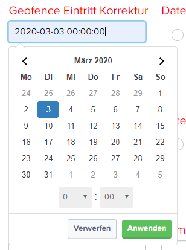
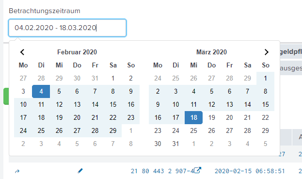

# Custom Datepicker
With this script you can convert a Splunk text input field to a custom date picker. The datepicker can be configured as single date or as date range picker.

Datepicker as single date:



Datepicker as range:



The selected date is saved as epoch timestamp in the token of the splunk inputfield. With the Rangepicker, the start time is saved in token.earliest and the end time in token.latest (as in the splunk timepicker)


### import and init:
```javascript
    require(['/static/app/db_rsi_wi_1web_u/customDatepicker/customDatepicker.js'], function(Datepicker) {
        //as single
        Daterangepicker.asSingleDate('in_austrittKorrektur', 
            {maxDate: true, 
            timePicker: true, 
            timePicker24Hour: true});

        //as Range
        Daterangepicker.asRange('in_timeFilter', {opens: 'right'});
    
    });
```

### SimpleXML:
```javascript

    <input id="in_austrittKorrektur" type="text" token="save_austrittKorrektur_tok">
        <label>Geofence Austritt Korrektur</label>
        <change>
          <condition match="...">
            ...
          </condition>
        </change>
    </input>


    <input id="in_timeFilter" type="text" token="timeFilter_tok" searchWhenChanged="true">
        <label>Betrachtungszeitraum</label>
    </input>
```

___

