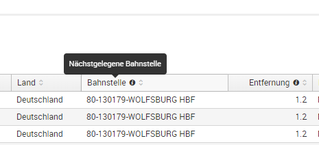
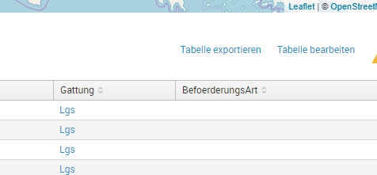
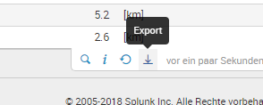
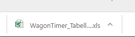
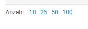
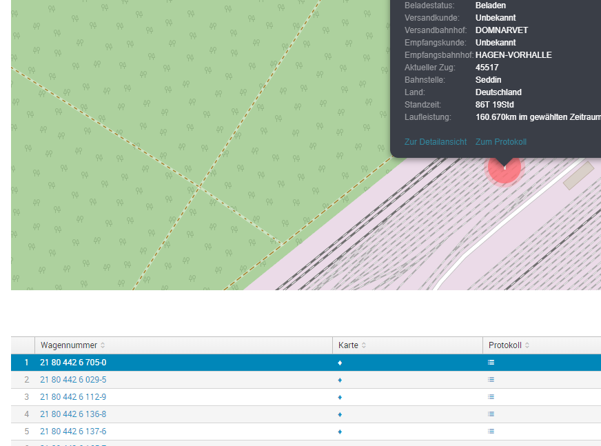
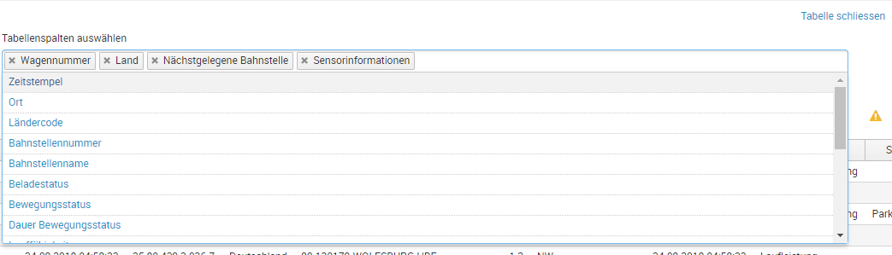
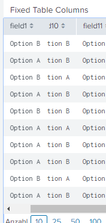

# Table
With this script you can add the following extensions to an existing Splunk table.

### import and init:
```javascript
    require(['/static/app/db_rsi_wi_1web_u/table/table.js'], function(Table) {
        var table = new Table('nameOfTable');
    });
```

___
## renameTableHeader

shortens column headers of a table and show the long information in a tooltip:




### use:
```javascript
    require(['/static/app/db_rsi_wi_1web_u/table/table.js'], function(Table) {

        var table = new Table('nameOfTable');

        //first parameter is the current header, which should be shown in tooltip
        //second paramter is the new header
        table.renameHeader('Nächstgelegene Bahnstelle', 'Bahnstelle');
        table.renameHeader('Entfernung zur Bahnstelle [km]', 'Entfernung');
    });
```

___
## addXlsExporter

adds a button to export the table in xls format

you can add a button above the table ...



... or overwrite the existing export-button in the splunk toolbar of the table:



the export will be saved on users computer automatically with the name or title of the table:


        
### use:

```javascript
    require(['/static/app/db_rsi_wi_1web_u/table/table.js'], function(Table) {

        var table = new Table('nameOfTable');

       //description of parameters see in section: parameters
        table.addExporter({
            showExternalButton: false,
            externalSearchId: 'nameOfExternalSearch',
            title: 'Filename of Exported File'
        });
    });
```
### parameters:

| parameter           | type    | optional | description                           |
| ---------           | ------- | ---------| --------------------------------------|
| `showExternalButton`| boolean | true     | true - if export button should be above the table, false - overwrite existing eport button in splunk toolbar of the table, default: true |
| `externalSearchId`  | string  | true     | whether to output a readme or just docs         |
| `title`             | string  | true     | a parsed package.json                           |


___
## addNumberOfTableRowsToggler
adds a count to a search of a table, so that the user can choose how many rows he want to see at once.

This feature needs configuration in JS and SimpleXML.




### use:

define a token and set it in init of simpleXML:

```xml
<init>
    <set token="tableRowsCountTok">10</set>
</init>
```

and use this token for the count option of the table:

```xml
<table>
...
<option name="count">$tableRowsCountTok$</option>
</table>
```

Initialisiation of the table of rows toggler in javascript:

```javascript
    require(['/static/app/db_rsi_wi_1web_u/table/table.js'], function(Table) {

        var table = new Table('nameOfTable');

        //parameter is the name of the token, which is used in simpleXML
        table.addNumberOfTableRowsToggler('tableRowsCountTok');
    });
```


### use:

___
## addDrilldownRowMarker
marks a selected row and sets a token with a selected value which cab be use for drilldown in another visualisation. In the screenshot below you can see a hovered row und the associated marker in a map:



this feature needs configuration in simpleXML and javascript!

### use: 

___
## addColumnChooser



### use: 


___
## addFixedColumn

freezes first column of table



### use: 


```javascript
    require(['/static/app/db_rsi_wi_1web_u/table/table.js'], function(Table) {

        var table = new Table('nameOfTable');

        table.addFixedColumn();
    });
```

___

# TODO

- toggle number of table rows: make steps configurable, default "10 25 50 100"
- drilldownMarker: refactor 3 parameters to a config-object: column, token, searchToken:
.addDrilldownRowMarker("Wagennummer", "selected_event", "put_first_tok")
