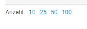
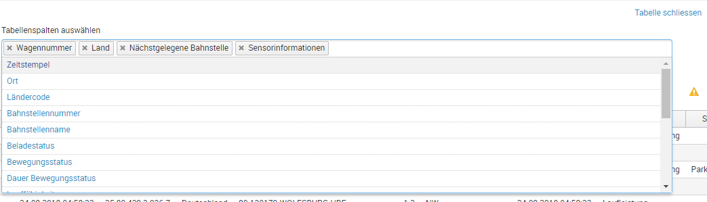

# Table
With this script you can add the following extensions to an existing Splunk table.

### import and init:
```javascript
    require(['/static/app/db_rsi_wi_1web_u/table/table.js'], function(Table) {
        var table = new Table('nameOfTable');
    });
```

___
## addNumberOfTableRowsToggler
adds a count to a search of a table, so that the user can choose how many rows he want to see at once.

This feature needs configuration in JS and SimpleXML.




### use:

define a token and set it in init of simpleXML:

```xml
<init>
    <set token="tableRowsCountTok">10</set>
</init>
```

and use this token for the count option of the table:

```xml
<table>
...
<option name="count">$tableRowsCountTok$</option>
</table>
```

Initialisiation of the table of rows toggler in javascript:

```javascript
    require(['/static/app/db_rsi_wi_1web_u/table/table.js'], function(Table) {

        var table = new Table('nameOfTable');

        //parameter is the name of the token, which is used in simpleXML
        table.addNumberOfTableRowsToggler('tableRowsCountTok');
    });
```
___
## addColumnChooser



### use: 


```javascript
    require(['/static/app/db_rsi_wi_1web_u/table/table.js'], function(Table) {

        var table = new Table('nameOfTable');

        //parameter is the name of the token, which is used in simpleXML
        table.addColumnChooser({
            cookieName: 'tableRowsTok_cookie', 
            inputfieldId: 'in_tableRowsTok'
        })
    });
```

#### Example SimpleXML:

InputField:

```xml
    <input type="multiselect" id="in_tableColumnsDetail" token="tableColumnsDetail_tok" searchWhenChanged="true">
      <label>Tabellenspalten auswählen</label>
      <default>Wagennummer,Land</default>  <-- columns which should be shown as default (before user selected his own fields)
      <choice value="Wagennummer">Wagennummer</choice>
      <choice value="Land">Land</choice>
      <choice value="Ort">Ort</choice>
      <prefix>| table Zeitstempel "</prefix>      <-- table-command here as prefix, with fields that should not be deselectable. This fields should not be listed as choice in input
      <suffix>"</suffix>
      <delimiter>" "</delimiter>
    </input>
````


Search-Command: 

```xml
    <query>| loadjob $searchBaseID$ | eval Zeitstempel=_time          
        | eval Beladestatus = Beladestatus.case(source_loadstatus=="Sensor",", seit ".if(loadstatus_lastChange="Unbekannt","Unbekannt",strftime(strptime(loadstatus_lastChange, `db_rsi_wi_1src_ma_eventTimeFormat`), "%d.%m.%Y %H:%M")),source_loadstatus=="FLO-LSO",", Information vom ".if(base_wgfTimestamp="Unbekannt","Unbekannt",strftime(strptime(base_wgfTimestamp, `db_rsi_wi_1src_ma_eventTimeFormat`), "%d.%m.%Y %H:%M")),1=1,", ")." (Quelle: ".source_loadstatus.")", Bewegungsstatus = Bewegungsstatus." seit ".if(moveState_lastChange="Unbekannt","Unbekannt",strftime(strptime(moveState_lastChange, `db_rsi_wi_1src_ma_eventTimeFormat`), "%d.%m.%Y %H:%M"))
        | fieldformat Zeitstempel = strftime(Zeitstempel, `db_rsi_wi_1src_ma_fieldformatTimeFormat`)
          $tableColumnsDetail_tok$ | rename gps_determination as " "</query>                                  <-- use token with table-command here in search-command
```
___

# TODO

- toggle number of table rows: make steps configurable, default "10 25 50 100"

